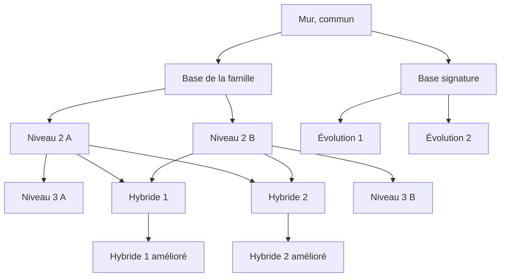

# Bâtisseurs

> Avant chaque partie, solo ou duel, le joueur choisit un bâtisseur parmi cinq. Chaque bâtisseur a son propre jeu de tours : une famille, deux hybrides et une lignée signature. Le but : des parties qui ne se ressemblent pas, et un choix de style de jeu dès le départ.

## 1. Contexte

Aujourd'hui, tout joueur a accès à toutes les tours : une fois les meilleures combinaisons trouvées, les parties se ressemblent. Les cartes *Legion TD* de Warcraft III ont montré qu'un bâtisseur choisi en début de partie, avec un jeu de tours limité et une identité forte, renouvelle chaque partie. Les cinq familles actuelles et leurs dix hybrides fournissent déjà l'essentiel du contenu.

## 2. Vocabulaire

| Terme | Définition |
|---|---|
| Bâtisseur | Jeu de tours choisi avant la partie, fixé jusqu'à la fin. |
| Famille | Arbre de tours existant (base, deux niveaux 2, deux niveaux 3) attribué à un bâtisseur. |
| Hybride | Tour obtenue en faisant évoluer un niveau 2 de la famille, comme aujourd'hui. Chaque bâtisseur n'en garde que deux. |
| Lignée signature | Nouvelle tour de base, propre au bâtisseur, avec deux évolutions au choix. |
| Aura | Bonus permanent donné par une tour aux autres tours proches. |
| Étourdir | Immobiliser une créature et l'empêcher d'agir pendant une durée donnée. |

## 3. Vue d'ensemble

## 4. Cas d'usage

### CU-01 — Choisir son bâtisseur en solo
**Acteur** joueur · **Intention** jouer la partie avec le style de son choix.
**Scénario nominal :**
1. Sur l'écran de choix de difficulté, voit les cinq bâtisseurs : nom, style, forces, faiblesse, tours de base.
2. En choisit un, puis lance la partie.
3. Ne peut construire et faire évoluer que les tours de son bâtisseur, plus le mur (RM-02).

### CU-02 — Choisir son bâtisseur en duel
**Acteur** joueur en duel · **Intention** choisir son style face à l'adversaire.
**Scénario nominal :**
1. Dans le salon, chaque joueur choisit son bâtisseur sans voir le choix de l'autre.
2. Le duel démarre quand les deux ont choisi. Chaque joueur voit alors le bâtisseur adverse.

**Variantes :** les deux joueurs peuvent choisir le même bâtisseur.

### CU-03 — Construire avec son bâtisseur
**Acteur** joueur · **Intention** bâtir son labyrinthe avec ses tours.
**Scénario nominal :**
1. Le menu de construction propose le mur (`Q`), la base de la famille (`W`) et la base signature (`E`) de son bâtisseur.
2. Le menu d'évolution d'une tour ne propose que les évolutions de son bâtisseur.

## 5. Règles métier

### RM-01 — Un bâtisseur par partie
- Chaque joueur choisit un bâtisseur avant la partie, en solo comme en duel. Il ne peut plus en changer jusqu'à la fin. · **Origine** *Legion TD* · **Concerne** CU-01, CU-02

### RM-02 — Seules les tours du bâtisseur
- Un joueur ne construit et ne fait évoluer que le mur et les tours de son bâtisseur (section 6). Le mur évolue vers les deux tours de base du bâtisseur. · **Origine** choix de design · **Concerne** CU-03
- **Non conforme :** un joueur Forge fait évoluer un mur en Tour d'archers.

### RM-03 — Deux hybrides par bâtisseur
- Les niveaux 2 de la famille évoluent vers leur niveau 3 ou vers l'un des deux hybrides du bâtisseur, et non plus vers quatre hybrides comme aujourd'hui. Prix et effets des hybrides sont inchangés. · **Origine** choix de design · **Concerne** CU-03

### RM-04 — Choix caché en duel
- En duel, le choix de l'adversaire est révélé seulement quand les deux joueurs ont choisi. · **Origine** choix de design (pas de contre-choix) · **Concerne** CU-02

### RM-05 — Corps à corps sans arrêt
- Une tour de corps à corps frappe toutes les créatures au sol à sa portée à chaque coup. Les créatures ne s'arrêtent jamais pour la combattre et continuent leur trajet. · **Origine** choix de design (le labyrinthe reste le cœur du jeu) · **Concerne** CU-03

### RM-06 — Auras non cumulables
- Une tour sous plusieurs auras du même type ne reçoit que la plus forte. Des auras de types différents (dégâts, vitesse d'attaque) se cumulent. Une tour ne reçoit pas sa propre aura. · **Origine** Warcraft III · **Concerne** CU-03
- **Exemple :** deux Porte-étendards à portée d'une même tour : +20 % de dégâts, pas +40 %.

### RM-07 — Épines
- Une tour à épines inflige ses dégâts par seconde, en continu, à toutes les créatures au sol à 1 case ou moins d'elle. Elle ne tire pas de projectile et ne touche pas les volants. · **Origine** choix de design · **Concerne** CU-03

### RM-08 — Étourdissement
- Une créature étourdie ne bouge plus et n'utilise plus ses capacités pendant la durée indiquée. Sur un chef, la durée est divisée par deux. · **Origine** Warcraft III · **Concerne** CU-03

### RM-09 — Montée en puissance
- La vitesse d'attaque d'une tour à montée en puissance augmente de 1 % par seconde passée avec au moins une cible à portée, jusqu'à son maximum. Elle retombe à zéro quand plus aucune créature n'est sur la carte. · **Origine** *Legion TD* · **Concerne** CU-03

### RM-10 — Règles de construction inchangées
- Anti-blocage du labyrinthe, remboursement à 50 % et taille des tours (2×2) s'appliquent aux nouvelles tours comme aux autres. · **Origine** comportement existant · **Concerne** CU-03

### RM-11 — Partie rejouable
- Même graine + mêmes bâtisseurs + mêmes ordres = même partie. · **Origine** comportement existant · **Concerne** transverse

## 6. Chiffres

### Bâtisseurs

| Bâtisseur | Style | Famille | Hybrides | Faiblesse |
|---|---|---|---|---|
| Bastion | corps à corps et auras, au cœur du labyrinthe | Archers | Baliste, Flèches de givre | peu de zone à distance |
| Forge | siège, zone, auras de vitesse | Canons | Obus cryogénique, Canon à foudre | contre les chefs |
| Sylve | poison, épines, ralentissement | Venin | Dard corrosif, Obus toxique | peu de dégâts directs |
| Sanctuaire | contrôle : lenteur, gel, étourdissement | Givre | Grêle, Givre nécrotique | faible contre les cibles seules |
| Arcanistes | magie, chaînes, montée en puissance | Foudre | Flèche foudroyante, Arc acide | contre les immunisés à la magie |

Les familles et les hybrides gardent leurs chiffres actuels.

### Lignées signature

| Bâtisseur | Tour | Évolue de | Prix (or) | Attaque | Effet |
|---|---|---|---|---|---|
| Bastion | Garde | mur | 15 | Normale 14–18 / 0,9 s, portée 1,5, sol | corps à corps (RM-05) |
| Bastion | Champion | Garde | 45 | Normale 45–55 / 0,9 s, portée 1,5, sol | corps à corps |
| Bastion | Porte-étendard | Garde | 45 | Normale 20–24 / 0,9 s, portée 1,5, sol | corps à corps ; aura +20 % de dégâts, 3 cases |
| Forge | Enclume | mur | 20 | Siège 16–20 / 1,2 s, portée 3,5, sol | aura +10 % de vitesse d'attaque, 3 cases |
| Forge | Haut fourneau | Enclume | 50 | Siège 30–36 / 1,2 s, portée 3,5, sol | aura +25 % de vitesse d'attaque, 3 cases |
| Forge | Marteau-pilon | Enclume | 50 | Siège 70–85 / 1,2 s, portée 3, sol | zone de 1,5 case |
| Sylve | Ronces | mur | 8 | Normale 6 / s, sol | épines (RM-07) |
| Sylve | Roncier | Ronces | 30 | Normale 20 / s, sol | épines ; poison 8 / s pendant 4 s, cumulable 3 fois |
| Sylve | Épine-mère | Ronces | 30 | Normale 14 / s, sol | épines ; lenteur de 20 % |
| Sanctuaire | Gong | mur | 20 | Magique 10 toutes les 4 s, 2,5 cases autour, sol et air | étourdit 0,5 s (RM-08) |
| Sanctuaire | Grand gong | Gong | 50 | Magique 30 toutes les 3,5 s, 3 cases autour, sol et air | étourdit 0,8 s |
| Sanctuaire | Carillon | Gong | 50 | Magique 20 toutes les 4 s, 2,5 cases autour, sol et air | étourdit 0,4 s ; lenteur de 30 % |
| Arcanistes | Pylône | mur | 20 | Magique 8–10 / 0,8 s, portée 4,5, sol et air | montée en puissance jusqu'à +100 % (RM-09) |
| Arcanistes | Condensateur | Pylône | 55 | Magique 25–30 / 0,8 s, portée 4,5, sol et air | montée en puissance jusqu'à +150 % |
| Arcanistes | Prisme volatil | Pylône | 55 | Magique 20–24 / 0,8 s, portée 4,5, sol et air | montée en puissance jusqu'à +100 % ; rebondit sur 3 cibles |

Prix = coût de l'évolution, comme pour les tours actuelles. Chaque bâtisseur garde de quoi toucher les volants grâce à sa famille.

## 8. Hors périmètre

| Exclusion | Raison |
|---|---|
| Bâtisseur tiré au sort | choix libre retenu |
| Changer de bâtisseur en cours de partie | identité fixe, comme dans *Legion TD* |
| Tours mélangées de plusieurs bâtisseurs | contraire au but |
| Niveau 3 pour les lignées signature | deux évolutions suffisent pour une première version |
| Nouveaux bâtisseurs au-delà de cinq | après retours de jeu |
| Bâtisseurs à déverrouiller | tous disponibles dès le départ |

## 9. Hypothèses

| # | Hypothèse | À valider par |
|---|---|---|
| H3 | Chaque bâtisseur, joué par le bot, finit la campagne en Recrue sur trois graines. | test d'équilibrage |
