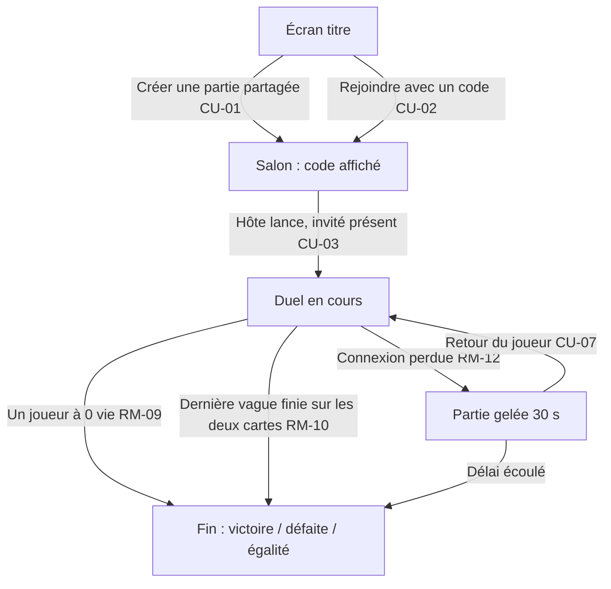

# Duel en ligne

> Deux joueurs, chacun chez soi, s'affrontent sur deux cartes identiques réunies sur un même plateau. Chacun construit seulement sur la sienne, peut aller regarder celle de l'autre par raccourci, et voit en permanence ses vies et son or. Mêmes vagues au même instant : le dernier en vie gagne.

## 1. Contexte

Le jeu est pensé pour jouer entre amis, mais on n'y joue que seul. Le README cite déjà le multijoueur comme piste, rendu possible par la simulation déterministe (même graine + mêmes ordres = même partie). Sans ce mode, pas de comparaison directe de labyrinthes ni de tension face à un adversaire.

## 2. Vocabulaire

| Terme | Définition |
|---|---|
| Duel | Partie à deux joueurs à distance, une carte chacun, mêmes vagues. |
| Hôte | Joueur qui crée la partie partagée et obtient le code. |
| Invité | Joueur qui rejoint la partie avec le code. |
| Code de partie | 6 lettres qui identifient une partie partagée en attente. |
| Salon | Écran d'attente entre la création du code et le lancement. |
| Plateau | Espace qui contient les deux cartes ; on en voit une à la fois. |
| Appel à deux | Appel anticipé d'une vague, effectif seulement quand les deux joueurs l'ont demandé. |

## 3. Vue d'ensemble

## 4. Cas d'usage

### CU-01 — Créer une partie partagée
**Acteur** hôte · **Intention** obtenir un code à transmettre à un ami.
**Scénario nominal :**
1. À l'écran titre, choisit « Partie à deux », saisit son pseudo, la difficulté et la carte.
2. Choisit « Créer une partie partagée ».
3. Le salon affiche le code et « En attente d'un adversaire… ».
4. Quand l'invité arrive, son pseudo s'affiche et « Lancer » devient disponible.

**Variantes :** l'hôte quitte le salon : le code est annulé.
**Refus :** service en ligne injoignable : « Impossible de créer la partie, vérifiez votre connexion. », retour à l'écran titre.

### CU-02 — Rejoindre avec un code
**Acteur** invité · **Intention** entrer dans la partie de l'hôte.
**Scénario nominal :**
1. À l'écran titre, choisit « Rejoindre », saisit son pseudo et le code.
2. Entre dans le salon ; voit le pseudo de l'hôte, la difficulté et la carte choisies.
3. Attend le lancement par l'hôte.

**Refus :** code inconnu, expiré ou partie déjà complète : « Code invalide ou partie déjà commencée. », saisie conservée.

### CU-03 — Lancer le duel
**Acteur** hôte · **Intention** démarrer la partie pour les deux.
**Scénario nominal :**
1. Appuie sur « Lancer ».
2. Les deux joueurs arrivent au même instant sur leur propre carte, même or, mêmes vies, même compte à rebours avant la vague 1.

**Refus :** aucun invité : bouton inactif.

### CU-04 — Jouer sur sa carte
**Acteur** joueur · **Intention** construire son labyrinthe comme en solo.
**Scénario nominal :** construire, améliorer, vendre, cibler comme en solo, sur sa carte uniquement. L'encart adverse (pseudo, vies, or) reste visible.

### CU-05 — Regarder la carte adverse
**Acteur** joueur · **Intention** voir le labyrinthe et les créatures de l'autre en direct.
**Scénario nominal :**
1. Appuie sur `O` (ou le bouton « Voir l'adversaire »).
2. La vue passe sur la carte adverse : tours, créatures, tirs, en direct.
3. Appuie sur `I` (ou « Ma carte ») pour revenir.

**Refus :** tout ordre sur la carte adverse (construire, améliorer, vendre, cibler, raccourcis de construction) est sans effet.
**Variantes :** sa propre partie continue pendant qu'il regarde ; une fuite sur sa carte est signalée (son + encart de vies).

### CU-06 — Appeler une vague à deux
**Acteur** joueur · **Intention** gagner le bonus d'appel anticipé.
**Scénario nominal :**
1. Appuie sur `Espace` : « Prêt — en attente de l'adversaire ».
2. L'adversaire voit « Adversaire prêt ».
3. Quand il appuie aussi, la vague part sur les deux cartes ; chacun reçoit le bonus.

**Variantes :** un joueur peut retirer sa demande en réappuyant ; le compte à rebours arrivé à 0 lance la vague sans bonus et efface les demandes.

### CU-07 — Revenir après une coupure
**Acteur** joueur déconnecté · **Intention** reprendre sa partie.
**Scénario nominal :**
1. La partie se gèle pour les deux ; l'autre joueur voit « Adversaire déconnecté — 30 s ».
2. Le joueur rouvre le jeu et saisit le même code dans les 30 s.
3. Sa carte revient dans l'état exact de la coupure, la partie reprend pour les deux.

**Refus :** délai dépassé : « La partie est terminée. »

## 5. Règles métier

### RM-01 — Même partie de départ
- Les deux cartes ont même disposition, même difficulté, mêmes vagues, même aléatoire. · **Origine** choix de design · **Concerne** CU-03
- Aucun ordre d'un joueur ne modifie la carte de l'autre.

### RM-02 — Réglages par l'hôte
- Difficulté et carte sont choisies par l'hôte et s'appliquent aux deux. L'invité ne peut pas les changer. · **Origine** choix de design · **Concerne** CU-01, CU-02

### RM-03 — Code de partie
- 6 lettres majuscules, sans `I` ni `O`. Valable du moment de la création jusqu'au lancement ou au départ de l'hôte. · **Origine** choix de design · **Concerne** CU-01, CU-02

### RM-04 — Deux joueurs exactement
- Un salon accepte un seul invité ; un troisième reçoit le refus de CU-02. · **Origine** choix de design · **Concerne** CU-02

### RM-05 — Pseudo
- 1 à 12 caractères ; vide : « Hôte » ou « Invité ». · **Origine** choix de design · **Concerne** CU-01, CU-02

### RM-06 — Carte adverse en lecture seule
- Sur la carte adverse, aucun ordre n'est accepté. · **Origine** demande · **Concerne** CU-05

### RM-07 — Temps commun, sans pause ni vitesse
- En duel, pause (`P`) et vitesse (`1 2 3`) sont indisponibles : les deux cartes avancent en temps réel ×1. Seule exception : le gel de RM-12. · **Origine** choix de design · **Concerne** transverse

### RM-08 — Vagues synchronisées, appel à deux
- Chaque vague démarre au même instant sur les deux cartes. L'appel anticipé ne part que lorsque les deux joueurs l'ont demandé ; chacun reçoit alors le bonus solo (moitié des secondes restantes, en or). · **Origine** choix de design ; bonus = comportement existant (`src/application/commands/callWave.ts:8`) · **Concerne** CU-06

### RM-09 — Élimination
- Dès qu'un joueur tombe à 0 vie, le duel s'arrête : l'autre gagne. Les deux à 0 au même instant : égalité. · **Origine** choix de design · **Concerne** transverse

### RM-10 — Fin de campagne
- Après la dernière vague terminée sur les deux cartes, le plus de vies restantes gagne ; vies égales : égalité. Pas de mode infini en duel. · **Origine** choix de design · **Concerne** transverse

### RM-11 — Informations adverses permanentes
- Pendant la partie, pseudo, vies et or de l'adversaire sont toujours affichés, quelle que soit la carte regardée. · **Origine** choix de design · **Concerne** CU-04, CU-05

### RM-12 — Coupure et forfait
- Si un joueur perd la connexion, la partie se gèle pour les deux pendant 30 s au plus. Retour dans le délai : reprise à l'identique. Sinon : victoire par forfait du joueur resté. · **Origine** choix de design · **Concerne** CU-07

### RM-13 — Abandon volontaire
- Quitter la partie en cours (bouton ou fermeture de l'onglet) déclenche RM-12 ; sans retour, forfait. · **Origine** choix de design · **Concerne** transverse

### RM-14 — Bilan de fin
- L'écran de fin affiche le verdict (Victoire, Défaite, Égalité, Victoire par forfait), les vies et la vague atteinte des deux joueurs, puis le bilan de partie existant de chacun. · **Origine** comportement existant (bilan de partie) · **Concerne** transverse

### RM-15 — Solo inchangé et hors ligne
- Le mode solo reste jouable sans connexion, avec ses règles actuelles (pause, vitesse, mode infini). · **Origine** comportement existant · **Concerne** transverse

### RM-16 — Mise en relation par le serveur du jeu
- Les joueurs sont reliés par le serveur qui héberge déjà le jeu ; aucun service tiers. Le duel exige donc une connexion pour les deux joueurs. · **Origine** choix de design (Pierre) · **Concerne** CU-01, CU-02, CU-07

## 6. Chiffres

| Élément | Valeur | Remarque |
|---|---|---|
| Joueurs par duel | 2 | |
| Code de partie | 6 lettres, alphabet sans I ni O | 24 lettres |
| Pseudo | 1 à 12 caractères | |
| Vitesse en duel | ×1 fixe | |
| Gel après coupure | 30 s | puis forfait |
| Voir carte adverse / revenir | `O` / `I` | + boutons HUD pour le tactile |
| Or, vies, difficulté | ceux de la difficulté choisie | `src/domain/catalog/creeps.ts:72` |

## 7. États et transitions

| État | Événement | État suivant | Condition |
|---|---|---|---|
| Salon (attente) | Invité rejoint | Salon (complet) | code valide, salon non complet |
| Salon (complet) | Invité quitte | Salon (attente) | |
| Salon (*) | Hôte quitte | — (annulé) | code invalidé |
| Salon (complet) | Hôte lance | Duel en cours | |
| Duel en cours | Coupure d'un joueur | Gelé | |
| Gelé | Retour du joueur | Duel en cours | ≤ 30 s |
| Gelé | 30 s écoulées | Terminé (forfait) | |
| Duel en cours | Un joueur à 0 vie | Terminé | RM-09 |
| Duel en cours | Dernière vague finie des deux côtés | Terminé | RM-10 |

## 8. Hors périmètre

| Exclusion | Raison |
|---|---|
| Plus de 2 joueurs | version minimale |
| Interaction entre cartes (envoi de créatures, sabotage) | demandé : aucune interaction |
| Discussion écrite | hors besoin |
| Liste publique de parties, matchmaking | le code suffit entre amis |
| Spectateurs | hors besoin |
| Revanche automatique | recréer une partie suffit |
| Mode infini en duel | RM-10 |

## 9. Hypothèses

| # | Hypothèse | À valider par |
|---|---|---|
| H1 | Cliquer une tour ou une créature adverse n'affiche rien (pas de fiche d'info). | Pierre |
| H2 | Mettre l'onglet en arrière-plan ne gèle pas la partie : elle continue, ou compte comme une coupure si le navigateur la suspend. | Pierre |
| H3 | Redémarrage du serveur pendant un duel ou un salon : parties en cours perdues, codes annulés, aucun verdict. | Pierre |
