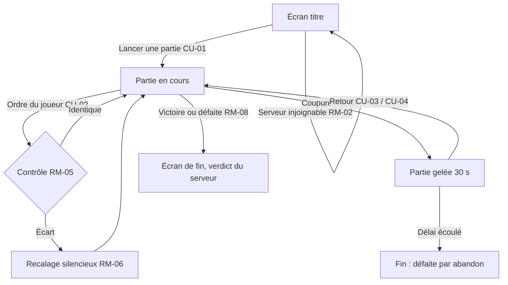

# Jeu en ligne (serveur de partie)

> Le jeu ne se joue plus qu'en ligne, à l'adresse du serveur qui l'héberge. Chaque partie solo est tenue par ce serveur : il reçoit les ordres du joueur, rejoue la partie de son côté et fait foi. Pour le joueur, rien ne change à l'écran ; ce socle est celui que le duel réutilisera à deux joueurs.

## 1. Contexte

Le duel en ligne (`todo/duel-en-ligne/SPEC.md`) a besoin d'un serveur qui tient la partie, relaie les ordres et arbitre le résultat. Plutôt que de réserver ce fonctionnement au duel, le solo l'adopte d'abord : un seul comportement, testé sur le cas le plus simple, que le duel étend ensuite à deux joueurs. Conséquence assumée : le jeu n'est plus jouable hors ligne, et la règle RM-15 du duel (« solo jouable sans connexion ») devient caduque.

## 2. Vocabulaire

| Terme | Définition |
|---|---|
| Serveur de partie | Le serveur qui héberge le jeu, tient chaque partie en cours et fait foi sur son déroulement. |
| Partie tenue | Partie connue du serveur, du lancement jusqu'à la fin. |
| Contrôle | Comparaison, par le serveur, de l'état de sa partie avec celui de la partie du joueur. |
| Recalage | Remise de la partie du joueur dans l'état du serveur après un contrôle en écart. |
| Coupure | Perte de la connexion entre le jeu et le serveur pendant une partie. |

## 3. Vue d'ensemble

## 4. Cas d'usage

### CU-01 — Lancer une partie solo
**Acteur** joueur · **Intention** commencer une partie comme aujourd'hui.
**Scénario nominal :**
1. Ouvre l'adresse du jeu ; l'écran titre s'affiche.
2. Choisit la difficulté et lance la partie.
3. La partie démarre, identique à aujourd'hui ; le serveur la tient dès cet instant.

**Refus :** serveur injoignable : « Impossible de lancer la partie, vérifiez votre connexion. », reste sur l'écran titre.

### CU-02 — Jouer
**Acteur** joueur · **Intention** construire, améliorer, vendre, cibler, appeler une vague, sans délai.
**Scénario nominal :**
1. Donne un ordre ; il s'applique aussitôt à l'écran, comme aujourd'hui.
2. Le serveur reçoit l'ordre, l'applique à sa partie au même instant de jeu, puis contrôle.

**Variantes :** pause (`P`) et vitesse (`1 2 3`) restent disponibles en solo ; le serveur suit.

### CU-03 — Coupure, page restée ouverte
**Acteur** joueur · **Intention** reprendre sans rien faire.
**Scénario nominal :**
1. La connexion tombe : la partie se gèle, « Connexion perdue — 30 s » avec décompte.
2. Le jeu retente seul de se reconnecter.
3. La connexion revient dans le délai : la partie reprend dans l'état du serveur.

**Refus :** délai écoulé : « La partie est terminée. », écran de fin (défaite par abandon).

### CU-04 — Coupure, page fermée ou rechargée
**Acteur** joueur · **Intention** retrouver sa partie après avoir fermé l'onglet.
**Scénario nominal :**
1. Rouvre l'adresse du jeu, dans le même navigateur, moins de 30 s après la coupure.
2. L'écran titre propose « Reprendre la partie ».
3. La partie reprend dans l'état du serveur, avec l'état de pause et la vitesse d'avant la coupure.

**Variantes :** le joueur choisit plutôt une nouvelle partie : l'ancienne est terminée (défaite par abandon).
**Refus :** plus de 30 s : aucune proposition de reprise, écran titre habituel.

## 5. Règles métier

### RM-01 — En ligne uniquement
- Le jeu n'est accessible qu'à l'adresse du serveur ; aucune partie ne se joue sans lui. · **Origine** choix de design (Pierre) · **Concerne** transverse

### RM-02 — Partie tenue dès le lancement
- Une partie ne démarre que si le serveur l'a acceptée ; c'est lui qui fixe la partie de départ (carte, difficulté, aléatoire). · **Origine** choix de design · **Concerne** CU-01

### RM-03 — Réactivité inchangée
- Un ordre s'applique à l'écran sans attendre le serveur ; accepté ou refusé avec le même message qu'aujourd'hui. · **Origine** comportement existant · **Concerne** CU-02

### RM-04 — Même partie des deux côtés
- Même partie de départ + mêmes ordres aux mêmes instants de jeu = même partie, chez le joueur comme sur le serveur. · **Origine** comportement existant (rejeu déterministe, `src/application/dispatch.ts:10`) · **Concerne** CU-02

### RM-05 — Contrôle après chaque ordre
- Après chaque ordre reçu, le serveur compare l'état de sa partie à celui du joueur au même instant de jeu. Aussi à la fin de partie. · **Origine** choix de design (Pierre) · **Concerne** CU-02
- Un ordre que le serveur refuse alors que le joueur l'a accepté est un écart.

### RM-06 — Recalage silencieux
- En cas d'écart, la partie du joueur est remise dans l'état du serveur et continue, sans message. · **Origine** choix de design (Pierre) · **Concerne** CU-02
- **Exemple :** le joueur a 120 or, le serveur 95 : après recalage, le joueur a 95 or et la partie continue.

### RM-07 — Coupure : gel 30 s puis abandon
- Coupure en cours de partie : la partie se gèle (ni temps ni ordre) pendant 30 s au plus. Retour dans le délai : reprise dans l'état du serveur. Sinon : défaite par abandon. · **Origine** choix de design, identique au duel (RM-12 du duel) · **Concerne** CU-03, CU-04

### RM-08 — Le serveur fait foi
- Verdict (victoire, défaite, défaite par abandon), vague atteinte et bilan de fin sont ceux de la partie du serveur. · **Origine** choix de design · **Concerne** transverse

### RM-09 — Reprise réservée au même navigateur
- « Reprendre la partie » n'est proposé que dans le navigateur où la partie a été lancée. · **Origine** choix de design · **Concerne** CU-04

### RM-10 — Règles solo inchangées
- Pause, vitesse, mode infini, bilan de partie et record par difficulté fonctionnent comme aujourd'hui. · **Origine** comportement existant · **Concerne** transverse

## 6. Chiffres

| Élément | Valeur | Remarque |
|---|---|---|
| Gel après coupure | 30 s | puis défaite par abandon ; même valeur que le duel |
| Contrôle | après chaque ordre + fin de partie | |

## 7. États et transitions

| État | Événement | État suivant | Condition |
|---|---|---|---|
| Écran titre | Lancer | En cours | serveur joignable |
| Écran titre | Reprendre | En cours | même navigateur, ≤ 30 s après la coupure |
| En cours | Coupure | Gelée | |
| Gelée | Retour | En cours | ≤ 30 s |
| Gelée | 30 s écoulées | Terminée (abandon) | |
| En cours | Victoire ou défaite | Terminée | verdict du serveur |
| En cours | Nouvelle partie demandée | Terminée (abandon) | |

## 8. Hors périmètre

| Exclusion | Raison |
|---|---|
| Comptes joueurs, identification | rien à rattacher en solo |
| Records et historique tenus par le serveur | pas de nouveauté visible voulue ; le record reste dans le navigateur |
| Reprise depuis un autre navigateur ou appareil | RM-09 |
| Jeu hors ligne | RM-01 |
| Duel (salon, code, deux cartes) | spec du duel, qui s'appuie sur celle-ci |

## 9. Hypothèses

| # | Hypothèse | À valider par |
|---|---|---|
| H1 | Onglet en arrière-plan : la partie s'arrête d'avancer chez le joueur ; ce n'est une coupure que si la connexion tombe. | Pierre |
| H2 | Redémarrage du serveur : parties en cours perdues, le joueur voit « La partie est terminée. » sans verdict ni record. | Pierre |
| H3 | Une partie en pause n'a pas de durée limite tant que la connexion tient. | Pierre |
| H4 | Le recalage conserve l'état de pause et la vitesse choisis par le joueur. | Pierre |
